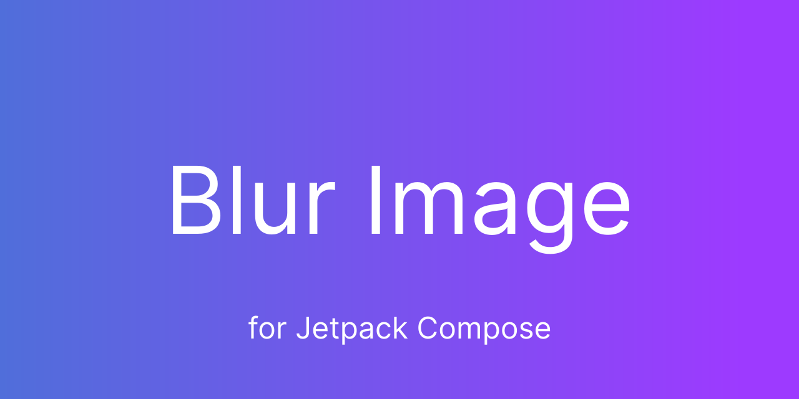

# BlurImage

[](https://jitpack.io/#MaximillianLeonov/BlurImage)

BlurImage is a Jetpack Compose library for displaying blurry images.

The library under the hood uses [Coil](https://github.com/coil-kt/coil) to load images
and [RenderScript Intrinsics Replacement Toolkit](https://github.com/MaximillianLeonov/renderscript-intrinsics-replacement-toolkit)
to blur.

# Usage

- `settings.gradle` / `settings.gradle.kts`

**Groovy:**

```gradle
dependencyResolutionManagement {
    // ...
    repositories {
        google()
        mavenCentral()
        // ...
        maven { url "https://jitpack.io" }
    }
}
```

**Kotlin DSL:**

```kotlin
dependencyResolutionManagement {
    // ...
    repositories {
        google()
        mavenCentral()
        // ...
        maven(url = "https://jitpack.io")
    }
}
```

- `build.gradle` / `build.gradle.kts`

**Groovy:**

```gradle
implementation "com.github.maximillianleonov:blurimage:1.0.0"
```

**Kotlin DSL:**

```kotlin
implementation("com.github.maximillianleonov:blurimage:1.0.0")
```

# Getting Started

```kotlin
/**
 * A BlurImage composable that executes an [ImageRequest] asynchronously and renders the result.
 *
 * @param data The data to load. The default supported data types are:
 * - [String] (mapped to a [Uri]).
 * - [Uri] ("android.resource", "content", "file", "http", and "https" schemes only).
 * - [HttpUrl].
 * - [File].
 * - [DrawableRes].
 * - [Drawable].
 * - [Bitmap].
 * - [ByteArray].
 * - [ByteBuffer].
 * @param contentDescription Text used by accessibility services to describe what this image
 * represents. This should always be provided unless this image is used for decorative purposes,
 * and does not represent a meaningful action that a user can take.
 * @param modifier Modifier used to adjust the layout algorithm or draw decoration content.
 * @param blurRadius The radius of the pixels used to blur, a value from 1 to 25. Default is
 * [DefaultBlurRadius].
 * @param placeholder A [Painter] that is displayed while the image is loading.
 * @param error A [Painter] that is displayed when the image request is unsuccessful.
 * @param fallback A [Painter] that is displayed when the request's [ImageRequest.data] is null.
 * @param onLoading Called when the image request begins loading.
 * @param onSuccess Called when the image request completes successfully.
 * @param onError Called when the image request completes unsuccessfully.
 * @param alignment Optional alignment parameter used to place the [AsyncImagePainter] in the given
 * bounds defined by the width and height.
 * @param contentScale Optional scale parameter used to determine the aspect ratio scaling to be
 * used if the bounds are a different size from the intrinsic size of the [AsyncImagePainter].
 * @param alpha Optional opacity to be applied to the [AsyncImagePainter] when it is rendered
 * onscreen.
 * @param colorFilter Optional [ColorFilter] to apply for the [AsyncImagePainter] when it is
 * rendered onscreen.
 * @param filterQuality Sampling algorithm applied to a bitmap when it is scaled and drawn into the
 * destination.
 */
@Composable
public fun BlurImage(
    data: Any?,
    contentDescription: String?,
    modifier: Modifier = Modifier,
    @IntRange(from = 1, to = 25) blurRadius: Int = DefaultBlurRadius,
    placeholder: Painter? = null,
    error: Painter? = null,
    fallback: Painter? = error,
    onLoading: ((AsyncImagePainter.State.Loading) -> Unit)? = null,
    onSuccess: ((AsyncImagePainter.State.Success) -> Unit)? = null,
    onError: ((AsyncImagePainter.State.Error) -> Unit)? = null,
    alignment: Alignment = Alignment.Center,
    contentScale: ContentScale = ContentScale.Fit,
    alpha: Float = DefaultAlpha,
    colorFilter: ColorFilter? = null,
    filterQuality: FilterQuality = DefaultFilterQuality
)
```

# License

```
Copyright 2022 Maximillian Leonov

Licensed under the Apache License, Version 2.0 (the "License");
you may not use this file except in compliance with the License.
You may obtain a copy of the License at

    http://www.apache.org/licenses/LICENSE-2.0

Unless required by applicable law or agreed to in writing, software
distributed under the License is distributed on an "AS IS" BASIS,
WITHOUT WARRANTIES OR CONDITIONS OF ANY KIND, either express or implied.
See the License for the specific language governing permissions and
limitations under the License.
```
